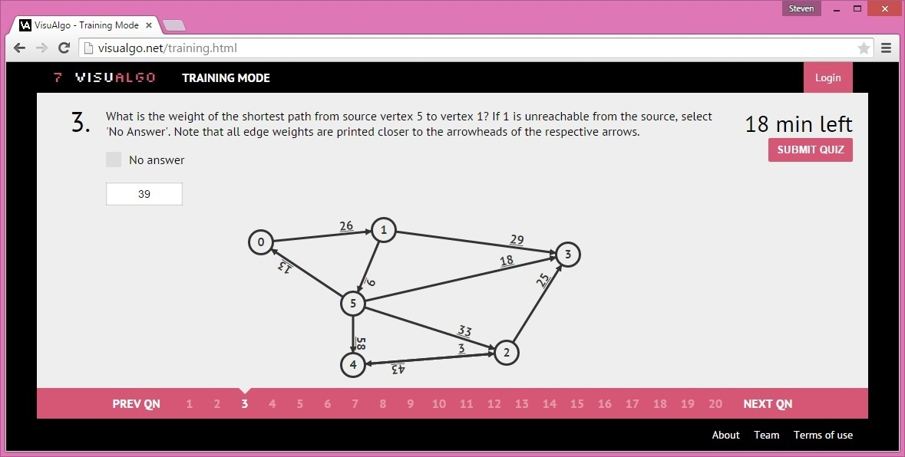

### 题意

VisuAlgo（http://visualgo.net）是由新加坡国立大学计算机学院团队开发的网站，是2015年ACM-ICPC亚洲新加坡地区的主页。VisuAlgo 可以可视化计算机科学课程中的一些流行的数据结构和算法。目前，它每天收到来自全球CS学生和导师的大约2000次提交。

VisuAlgo 的一个新功能是在线测试。例如， 上图显示了关于图论中终点唯一的最短路径的问题。这个在线测试功能的有点于问题的参数是随机的。图G具有 $V$ 个顶点编号为 $[0 .. V-1]$ ， 从 $[0 .. V - 1]$ 中随机选取起点 $s$ 和终点 $t$ 。

 VisuAlgo的开发人员希望计算出 $s$ 到 $t$ 的最短路的数量，请帮助他们。

### Input

第一行输入包含两个非负整数 $V, E(1 \leq V \leq 10000, 0 \leq E \leq 200000)$ ，给出G的顶点数和边数。

之后跟着 $E$ 行，每一行包含三个整数 $u, v, w(0 \leq u, v \leq V -1, 1 \leq w \leq 99)$ 表示有向图G中的一条边，从 $u$ 连向 $v$ 权值为 $w$ 。

输入保证G是一个简单图，没有自环，同一对顶点之间没有多条方向相同的边。

最后一行有两个整数 $s, t(0 \leq s, t \leq V - 1)$ ，表示起点和终点。

### Ouput

输出从 $s$ 到 $t$ 的最短路的数量。确保答案是32位有符号整形。

### 题解

一开始最简单的想法为跑一遍Dijkstra，用data[i]记录该点被经过的次数，之后从终点dfs回溯，如果一个点被经过一次，则++data[i]，这样答案就是 data[s]，虽然AC了，但是卡着时间过的。

其实有更优越的写法。Dijkstra在判断一个节点是否需要更新时，如果该节点需要更新，则data[node]=data[from]（from为来源节点，node为被更新的节点），如果该节点的距离起点的距离等于想要更新的值，即 d[node] = d[from] + w ，则data[node] += data[from]。这样跑完一遍Dijkstra就可以得到答案，答案即为data[t]。